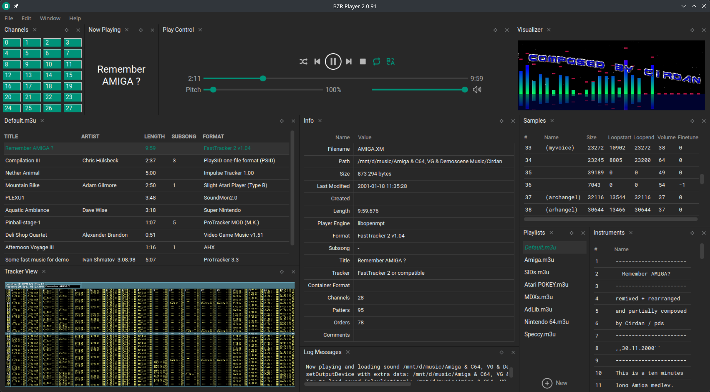

# BZR Player 2 (BZR2)

Audio player for **Windows** and **Linux** supporting a wide array of multi-platform **exotic** file
formats, written in **C++** and **Qt** with a sound engine based on **FMOD**.\
The first BZR version was released in 2008, the last 1.x in 2019: this is the beginning of the new 2.x version which is
coded pretty much from scratch.



----

## Plugins and supported formats

BZR2 is designed with a modular plugin system to support multiple third party audio playback libraries:

- **plugin_adplug**: [AdPlug](https://github.com/adplug/adplug)
- **plugin_asap**: [ASAP](https://sourceforge.net/projects/asap)
- **plugin_audiodecoder.wsr**: [audiodecoder.wsr](https://github.com/xbmc/audiodecoder.wsr)
- **plugin_audiofile**: [Audio File Library](https://github.com/mpruett/audiofile)
- **plugin_flod**: custom C++ port of [Flod](https://github.com/photonstorm/Flod)
- **plugin_furnace**: [Furnace](https://github.com/tildearrow/furnace)
- **plugin_game-music-emu**: [Game_Music_Emu](https://github.com/libgme/game-music-emu)
- **plugin_highly_experimental**: [Highly Experimental](https://gitlab.com/kode54/highly_experimental) + [psflib](https://gitlab.com/kode54/psflib)
- **plugin_highly_quixotic**: [Highly Quixotic](https://gitlab.com/kode54/highly_quixotic) + [psflib](https://gitlab.com/kode54/psflib)
- **plugin_highly_theoretical**: [Highly Theoretical](https://gitlab.com/kode54/highly_theoretical) + [psflib](https://gitlab.com/kode54/psflib)
- **plugin_hivelytracker**: [HivelyTracker](https://github.com/pete-gordon/hivelytracker)
- **plugin_jaytrax**: [Jaytrax](https://github.com/pachuco/jaytrax)
- **plugin_kdm**: custom adaptation of [KDM Decoder](https://www.foobar2000.org/components/view/foo_input_kdm)
- **plugin_klystron**: [klystron](https://github.com/kometbomb/klystron)
- **plugin_lazyusf2**: [lazyusf2](https://gitlab.com/kode54/lazyusf2) + [psflib](https://gitlab.com/kode54/psflib)
- **plugin_libkss**: [libkss](https://github.com/digital-sound-antiques/libkss)
- **plugin_libopenmpt**: [libopenmpt](https://lib.openmpt.org/libopenmpt)
- **plugin_libpac**: [libpac](http://prdownloads.sourceforge.net/libpac)
- **plugin_libsidplayfp**: [libsidplayfp](https://github.com/libsidplayfp/libsidplayfp) + [sidid](https://github.com/cadaver/sidid)
- **plugin_libstsound**: [libstsound](https://github.com/cpcsdk/libstsound)
- **plugin_libvgm**: [libvgm](https://github.com/ValleyBell/libvgm)
- **plugin_libxmp**: [libxmp](https://github.com/libxmp/libxmp)
- **plugin_mdxmini**: [mdxmini](https://github.com/mistydemeo/mdxmini)
- **plugin_organya-decoder**: [Organya decoder](https://www.cavestory.one/download/music-players.php)
- **plugin_protrekkr**: [ProTrekkr](https://github.com/hitchhikr/protrekkr)
- **plugin_sc68**: [sc68](https://sourceforge.net/p/sc68)
- **plugin_sndh-player**: [SNDH-Archive-Player](https://github.com/arnaud-carre/sndh-player)
- **plugin_sunvox_lib**: [SunVox Library](https://warmplace.ru/soft/sunvox)
- **plugin_uade**: [UADE (mvtiaine)](https://gitlab.com/mvtiaine/uade) + custom C++ port of [Flod](https://github.com/photonstorm/Flod) (for samples viewer)
- **plugin_v2m-player**: [v2m-player](https://github.com/jgilje/v2m-player)
- **plugin_vgmstream**: [vgmstream](https://github.com/vgmstream/vgmstream) + extended [ffmpeg](https://github.com/FFmpeg/FFmpeg) support + [libcue](https://github.com/lipnitsk/libcue)
- **plugin_vio2sf**: [vio2sf](https://gitlab.com/kode54/vio2sf) + [psflib](https://gitlab.com/kode54/psflib)
- **plugin_zxtune**: [ZXTune](https://github.com/vitamin-caig/zxtune)

In addition to these **FMOD** itself is used to provide support for both MIDI and network streams playback

### Supported formats

[Here](samples) you can find an (incomplete) list of supported formats samples grouped by plugin

----

## How to get

- [Releases & changelogs](https://github.com/aargirakis/BZRPlayer/releases)
- AUR package: [`bzr-player`](https://aur.archlinux.org/packages/bzr-player)
- [Old versions archive](https://github.com/aargirakis/BZRPlayer/tree/binaries_archive/binaries)

----

## How to build

### Windows

**[MSYS2](https://www.msys2.org/)** with following packages is required:

`base-devel` `mingw-w64-ucrt-x86_64-cmake` `mingw-w64-ucrt-x86_64-qt6-base` `mingw-w64-ucrt-x86_64-qt6-svg`
`mingw-w64-ucrt-x86_64-qt-advanced-docking-system` `mingw-w64-ucrt-x86_64-SDL2` `mingw-w64-ucrt-x86_64-toolchain`
`openssl-devel`

From the MSYS2 **ucrt64.exe** command prompt go to the project sources dir (keep in mind Unix-style paths are
required), then start the configuration process executing:\
`cmake -B cmake-build -S . -DCMAKE_PREFIX_PATH=/ucrt64 -DCMAKE_BUILD_TYPE=`[`Debug`|`Release`]` -G Ninja`

To build the project execute:\
`ninja -C cmake-build`

As result of the building process, in the chosen CMake build directory the `output` directory will be populated with
binaries.\
If the **Release** build type is selected, along with `output` also `output_release` directory will be created,
containing the final archive release file

#### Build example

```
cd /c/BZRPlayer
cmake -B cmake-build -S . -DCMAKE_PREFIX_PATH=/ucrt64 -DCMAKE_BUILD_TYPE=Release -G Ninja &&
ninja -C cmake-build
```

#### IDE setup

These are the settings for any IDE that supports CMake:

- set the toolchain to **<MSYS2_dir>\ucrt64**\
  (e.g. `C:\msys64\ucrt64`)


- set the CMake command with following flags:\
  **-DCMAKE_PREFIX_PATH="<MSYS2_dir>/ucrt64" -G Ninja**\
  (e.g. `-DCMAKE_PREFIX_PATH="c:/msys64/ucrt64" -G Ninja`)


- set additional environment variables **MSYSTEM=UCRT64** and **PATH=<MSYS2_dir>/usr/bin**\
  (e.g. `MSYSTEM=UCRT64;PATH=c:/msys64/usr/bin`)


- set the CMake application runner to build **All targets** with `app` as executable


- (optional) set CMake executable to **<MSYS2_dir>\ucrt64\bin\cmake.exe**\
  (e.g. `C:\msys64\ucrt64\bin\cmake.exe`)

#### Windows installer

The **BZR2 installer for Windows**, which is scripted in **Nullsoft Scriptable Install System (NSIS)**, can
be only compiled using **WSL2** or cross-compiled on Linux, since contains Linux specific code (mostly the bash script
for the XDG MIME types handling), also **MSYS2** is currently not viable since the required **NSIS** plugins are
still missing.

**NSIS** (3.10 or newer) with following plugins (check AUR entries) is required:

- [AccessControl](https://nsis.sourceforge.io/AccessControl_plug-in) `nsis-accesscontrol-bin`
- [NsArray](https://nsis.sourceforge.io/Arrays_in_NSIS) `nsis-nsarray-bin`
- [NsProcess](https://nsis.sourceforge.io/NsProcess_plugin) `nsis-nsprocess-bin`
- [Registry](https://nsis.sourceforge.io/Registry_plug-in) `nsis-registry-bin`

In order to build the Windows installer put the target binaries in `src/inst/nsis/bin` then enter `src/inst/nsis`
directory and execute: `makensis -DVERSION="<any_version>" bzr2_setup.nsi`\
As result of the building process `bzr-player-<any_version>-win64.exe` will be generated in the same directory.

### Linux

In order to build BZR2 following packages are required:

- On **Arch-based** distros:\
  `base-devel` `cmake` `dos2unix` `libglvnd` `ninja` `patchutils` `qt6-base` `qt-advanced-docking-system`
  `qt6-declarative` `qt6-svg` `sdl2-compat` `vulkan-headers`


- On **Debian-based** distros:\
  `build-essential` `cmake` `dos2unix` `libglvnd0` `libsdl2-dev` `libvulkan-dev` `ninja-build` `patchutils`
  `qt6-base-dev` `qt6-base-private-dev` `qt6-declarative-dev` `qt6-svg-dev`
  `libqt-advanced-docking-system-dev]`
  ([libqt-advanced-docking-system-dev4](https://github.com/aargirakis/BZRPlayer/releases/latest/download/libqt-advanced-docking-system-dev4_4.4.1-0_amd64-ubuntu-24.04.deb)
  for Ubuntu 24.04 and equivalent)


- On **Fedora-based** distros:\
  `@c-development` `@development-tools` `cmake` `dos2unix` `ninja-build` `qt6-qtbase-devel` `qt6-qtsvg-devel`
  `Qt-Advanced-Docking-System-devel` `sdl2-compat-devel` `vulkan-headers` `which`

Go to the project sources dir then start the configuration process executing:\
`cmake -B cmake-build -S . -DCMAKE_PREFIX_PATH=/usr -DCMAKE_BUILD_TYPE=`[`Debug`|`Release`]` -G Ninja`

To build the project execute:\
`ninja -C cmake-build`

#### Build example

```
cd ~/bzr-player &&
cmake -B cmake-build -S . -DCMAKE_PREFIX_PATH=/usr -DCMAKE_BUILD_TYPE=Debug -G Ninja &&
ninja -C cmake-build 
```

#### Runtime dependencies

For running BZR2 following packages are required:

- On **Arch-based** distros:\
  `qt6-base` `qt6-svg` `qt-advanced-docking-system`


- On **Debian-based** distros:\
  `libqt6core6` `libqt6network6` `libqt6openglwidgets6` `libqt6svg6` `libqt6xml6`
  `libqt-advanced-docking-system4`
  ([libqt-advanced-docking-system4](https://github.com/aargirakis/BZRPlayer/releases/latest/download/libqt-advanced-docking-system4_4.4.1-0_amd64-ubuntu-24.04.deb)
  for Ubuntu 24.04 and equivalent)


- On **Fedora-based** distros:\
  `qt6-qtbase` `qt6-qtsvg` `Qt-Advanced-Docking-System`

#### Generated binaries

On Linux, as result of the building process, in the chosen CMake build directory the `output` directory will be
populated with binaries.\
If the **Debug** build type is selected BZR2 will use development paths instead of system ones: this means all paths
will refer to the `output` directory (including the user settings and the executable's RPATH) ensuring a complete
isolation from any other (real) BZR2 installation (ideal for development purposes).\
If **Release** build type is selected then the system paths will be used (this also means generated binaries will work
only if they are installed in the correct system paths)

### Offline mode

By default, the CMake configuration stage will download all needed libraries and files. Add `-DOFFLINE_MODE=1` to CMake
command for switching to offline mode.\
Offline mode doesn't guarantee that the build will include the latest versions of the files with unmanaged version

----

## Reach us

You can find us on [Discord](https://discord.gg/feEBce8cFe) for feedback and discussion